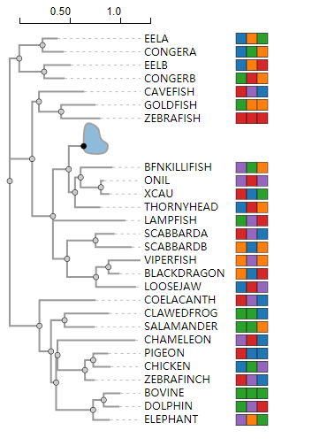
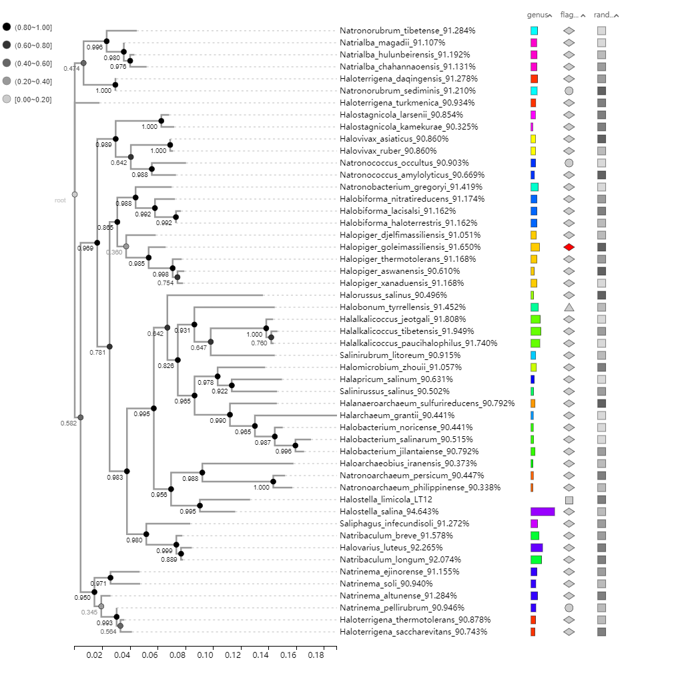

# 进化树

## 下载
```
npm install
```
## 初始化
```
npm install
```

## 运行
```
npm run dev
```
在浏览器中打开 http://localhost:3000/examples/

## 打包
```
npm run build
```
## 部分案例
##### 案例1

##### 案例1

##### 案例2

##### 案例3
